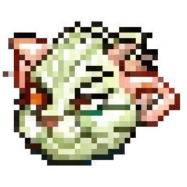

# Tamagotchi

   

## Short description
Tamagotchi is a game developed in C++20 using the SFML library and Google Test. The aim of the game is to take care of a virtual pet by managing its health, energy, hunger, hygiene, and happiness. Players can interact with the pet by feeding it, cleaning it, playing with it, or putting it to sleep.

## Screenshots

## Installation
To install and run the Tamagotchi game, follow these steps:

1. Clone the project repository.
2. Install CMake build system on your machine if not already installed.
3. Build the project using CMake, specifying the appropriate source and installation directories.
4. Run the executable generated after building.

## How to use it?
Once the Tamagotchi game is compiled and executed, follow these steps to play:
1. Navigate through the menu screen to start the game or access other features.
2. On the Tamagotchi screen, interact with the pet using the provided buttons (eat, play, wash, sleep).
3. Play the mini-game to collect coins and increase the pet's happiness.
4. View the scoreboard to see your score compared to others.
5. Explore the game's credits to learn about the development team and acknowledgments.
